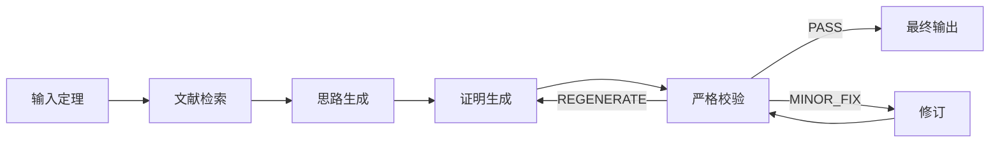

# 数学证明助手（Proof Assistant）

面向「证明思路整理 + 证明草稿生成」的 Web 应用。  
输入 **定理陈述** 和 **已知条件**，系统通过多阶段 AI 流水线自动生成可渲染（MathJax）的数学证明文本。

---

## 功能概览

### 证明生成流水线



1. **文献检索（Literature Search）**  
   根据定理内容自动提取数学术语关键词（纯规则提取，不消耗 AI API），从 arXiv 和 Crossref 检索相关论文。搜索结果经过多维度评分（术语命中率 30% + 方法匹配 25% + 领域匹配 25% + 新鲜度 20%），压缩为 ~150 token 的 Literature Brief 注入到后续 AI prompt 中。

2. **思路生成（Idea Brainstorming）**  
   结合文献摘要和知识库参考，输出可行的证明路线（Possible Proof Ideas）和候选定理（Candidate Theorems）。

3. **证明生成（Proof Generation）**  
   基于思路、文献和知识库参考，生成候选证明草稿。

4. **严格校验（Verification）**  
   判定 `PASS`（通过）/ `MINOR_FIX`（小修订）/ `REGENERATE`（重生成）。

5. **修订（Revision）**  
   对 MINOR_FIX 进行局部修复，最多 3 轮；对 REGENERATE 重新生成，最多 2 轮。

6. **渲染输出**  
   MathJax 渲染为可读公式版证明，支持 Compiled（渲染）和 Source（源码）视图切换。

### 知识库（Knowledge Base）

用户可上传 PDF 论文，系统通过 DeepSeek 自动提取：

| 字段 | 说明 |
|------|------|
| `type` | theorem / lemma / corollary / proposition / proof |
| `statement` | 定理陈述 |
| `proofSummary` | 证明摘要 |
| `proofMethods` | 证明方法标签：induction, contradiction, construction, direct, contrapositive, exhaustion, probabilistic, combinatorial, algebraic, analytic, topological, other |
| `prerequisites` | 前置依赖（如 "Hoeffding inequality", "Borel-Cantelli lemma"） |
| `mathematicalDomain` | 数学领域（probability, statistics, analysis, algebra, topology, combinatorics, number theory, optimization, geometry, logic） |
| `keywords` | 关键词列表 |
| dynamic importance | 根据用户输入、关键词、语义相似度、证明方法和领域动态计算 |

**检索算法**：对新输入的定理，使用 6 维加权评分从知识库中检索最相关的条目：

| 维度 | 权重 | 方法 |
|------|------|------|
| 主题频率 | 15% | 论文主题在语料库中的出现频率 |
| 关键词匹配 | 20% | TF-IDF 加权的关键词精确匹配 |
| 语义相似度 | 20% | TF-IDF + bigram 的余弦相似度 |
| 定理重要性 | 10% | 根据用户输入动态计算的 importance |
| 证明方法匹配 | 20% | 从查询文本检测证明方法，与条目标签比对 |
| 领域匹配 | 15% | 数学领域别名映射匹配 |

知识库支持 JSON 格式导入/导出，方便团队共享和版本管理。

### 多模型支持

右上角选择 Proof Model；Knowledge Base 面板内单独选择 Knowledge Base Model，PDF 上传和 KB Generate 使用知识库模型。

| 模型 | 说明 |
|------|------|
| DeepSeek V4 Pro | DeepSeek 最新旗舰，推理能力最强（默认） |
| DeepSeek V4 Flash | DeepSeek 最新轻量版，速度快成本低 |

---

## 技术架构

| 层级 | 技术 |
|------|------|
| 前端 | React 19 + Vite + TypeScript + Tailwind CSS v4 |
| 后端 | Express + tsx（`server.ts` 挂载 `/api/*.ts` 路由） |
| AI 模型 | DeepSeek（REST API） |
| 文献检索 | arXiv API + Crossref API |
| 公式渲染 | MathJax CDN |

### API 路由

| 路由 | 说明 |
|------|------|
| `POST /api/generate-ideas` | DeepSeek 思路生成（兼容旧路由） |
| `POST /api/generate-ideas-deepseek` | DeepSeek 思路生成 |
| `POST /api/generate-proof` | DeepSeek 证明生成（兼容旧路由） |
| `POST /api/generate-proof-deepseek` | DeepSeek 证明生成 |
| `POST /api/verify-proof` | DeepSeek 证明校验（兼容旧路由） |
| `POST /api/verify-proof-deepseek` | DeepSeek 证明校验 |
| `POST /api/revise-proof` | DeepSeek 小修订（兼容旧路由） |
| `POST /api/revise-proof-deepseek` | DeepSeek 小修订 |
| `POST /api/literature-search` | 文献检索（arXiv + Crossref） |
| `POST /api/ingest-paper` | PDF 论文知识提取 |

所有证明相关 API 接受 `literatureBrief`（压缩文献摘要字符串）和 `knowledgeReferences`（加权知识库引用）参数。

---

## 本地部署（macOS / Linux / Windows）

### 前置要求

- **Node.js 18+**（推荐 22 LTS）：[下载地址](https://nodejs.org/)
- **API Key**：
  - DeepSeek API Key：[申请地址](https://platform.deepseek.com/api_keys)

### 第 1 步：克隆项目

```bash
git clone https://github.com/yangheihei2/-.git
cd -
```

### 第 2 步：安装依赖

```bash
npm install
```

### 第 3 步：配置环境变量

在项目根目录创建 `.env.local` 文件：

```bash
# macOS / Linux
cp .env.example .env.local
```

然后编辑 `.env.local`，填入你的 API Key：

```env
# 必填
DEEPSEEK_API_KEY=your_deepseek_api_key_here

# 可选：DeepSeek 单次请求超时（毫秒），默认 90000（90 秒）
# DEEPSEEK_REQUEST_TIMEOUT_MS=90000
```

### 第 4 步：启动

```bash
npm run dev
```

启动后会看到类似输出：

```
  VITE v6.x.x  ready in xxx ms

  ➜  Local:   http://localhost:3000/

  API server running at http://localhost:3001
  Routes: /api/generate-ideas, /api/generate-proof, ...
```

打开浏览器访问 **http://localhost:3000** 即可使用。

> `npm run dev` 会同时启动：
> - **前端**（Vite，端口 3000，带热更新）
> - **后端 API**（Express，端口 3001，自动代理）
>
> 你只需访问 `localhost:3000`，所有 API 请求会自动转发到后端。

### 其他命令

| 命令 | 用途 |
|------|------|
| `npm run dev` | 启动前端 + API 服务器（开发模式） |
| `npm run dev:client` | 仅启动前端 |
| `npm run dev:server` | 仅启动 API 服务器 |
| `npm run build` | 构建生产版本前端 |
| `npm run lint` | TypeScript 类型检查 |
| `npm run start` | 启动 API 服务器（生产模式） |

---

## 生产部署（VPS / 云服务器）

### 方式一：直接部署

```bash
# 1. 安装 Node.js 22+
curl -fsSL https://deb.nodesource.com/setup_22.x | sudo bash -
sudo apt-get install -y nodejs

# 2. 克隆并安装
git clone https://github.com/yangheihei2/-.git
cd -
npm install

# 3. 配置环境变量
cp .env.example .env.local
nano .env.local   # 填入 API Key

# 4. 构建前端
npm run build

# 5. 用 PM2 守护进程运行
npm install -g pm2
pm2 start "npm run start" --name proof-assistant
pm2 save
pm2 startup   # 设置开机自启
```

### 方式二：Nginx 反向代理（推荐用于公网访问）

```nginx
server {
    listen 80;
    server_name your-domain.com;

    # 前端静态文件
    location / {
        root /path/to/-/dist;
        try_files $uri $uri/ /index.html;
    }

    # API 代理到 Express
    location /api/ {
        proxy_pass http://127.0.0.1:3001;
        proxy_set_header Host $host;
        proxy_set_header X-Real-IP $remote_addr;
        proxy_read_timeout 300s;   # AI 生成可能需要较长时间
        proxy_send_timeout 300s;
        send_timeout 300s;
    }
}
```

> 如果候选证明生成仍提示超时，请确认前端已重新执行 `npm run build` 并重启 PM2。
> Nginx 的 `proxy_read_timeout` 只控制反向代理等待时间；应用本身也会按前端和 DeepSeek 客户端的超时配置主动中断请求。

### 方式三：Docker（可选）

```dockerfile
FROM node:22-alpine
WORKDIR /app
COPY package*.json ./
RUN npm ci
COPY . .
RUN npm run build
EXPOSE 3001
CMD ["npm", "run", "start"]
```

```bash
docker build -t proof-assistant .
docker run -d -p 3001:3001 --env-file .env.local proof-assistant
```

---

## 项目结构

```text
.
├─ api/
│  ├─ generate-ideas.ts           # DeepSeek 思路生成（兼容旧路由）
│  ├─ generate-ideas-deepseek.ts  # DeepSeek 思路生成
│  ├─ generate-proof.ts           # DeepSeek 证明生成（兼容旧路由）
│  ├─ generate-proof-deepseek.ts  # DeepSeek 证明生成
│  ├─ verify-proof.ts             # DeepSeek 证明校验（兼容旧路由）
│  ├─ verify-proof-deepseek.ts    # DeepSeek 证明校验
│  ├─ revise-proof.ts             # DeepSeek 小修订（兼容旧路由）
│  ├─ revise-proof-deepseek.ts    # DeepSeek 小修订
│  ├─ literature-search.ts        # 文献检索
│  └─ ingest-paper.ts             # PDF 知识提取
├─ lib/
│  └─ deepseek-client.ts          # DeepSeek API 客户端
├─ src/
│  ├─ App.tsx                     # 主应用组件
│  ├─ main.tsx                    # 入口
│  ├─ index.css                   # 全局样式
│  └─ kb.ts                       # 知识库类型定义 + 检索算法
├─ server.ts                      # Express API 服务器（本地开发 + 部署）
├─ index.html
├─ package.json
├─ tsconfig.json
└─ vite.config.ts
```

---

## 文献检索工作原理

### 关键词提取

采用**纯规则提取**（不消耗 AI API）：
- 20+ 组数学术语正则模式匹配（覆盖概率、分析、代数、拓扑、组合等领域）
- 数学停用词过滤（排除 "the", "let", "prove" 等通用词）
- 通用 token 补充（≥4 字符的非停用词）
- 最终输出 ≤10 个关键词

### 搜索策略

- **arXiv**：支持按领域（`cat:math.PR` 等）过滤，自动从 `researchField` 映射到 arXiv category
- **Crossref**：按文献计量学评分搜索
- 并行发起两个搜索，去重后取 top 8

### 评分公式

```
score = termScore × 0.30 + tokenScore × 0.25 + methodScore × 0.25 + freshnessScore × 0.20
```

| 维度 | 说明 |
|------|------|
| termScore | 数学专业术语在论文标题/摘要中的命中率 |
| tokenScore | 通用 token 在标题/摘要中的命中率 |
| methodScore | 证明方法关键词匹配 |
| freshnessScore | ≤3年=1.0, ≤7年=0.7, ≤15年=0.4, >15年=0.2 |

### 注入方式

搜索结果压缩为 **Literature Brief**（~150 tokens），格式：

```
1. "Order statistics and quantile control" (arXiv 2021, score=0.87) — relevant tags
2. "Hoeffding's inequality extensions" (Crossref 2019, score=0.82) — relevant tags
3. "Sequential hypothesis testing" (arXiv 2023, score=0.79) — relevant tags
```

这段文本作为 `literatureBrief` 参数注入到 `generate-ideas` 和 `generate-proof` 的 prompt 中，让 AI 参考已有文献进行证明。

---

## 适用场景

- 数学课程作业中的证明草稿探索
- 论文写作前的证明路径头脑风暴
- 团队讨论时对比不同证明策略
- 教学中展示「从想法到证明」的完整链路

---

## 注意事项

- 本项目输出的是 **AI 生成证明草稿**，不保证 100% 正确
- 用于作业、论文或正式发表前，请务必人工校验关键步骤
- 对高难度命题，建议结合文献与人工推导共同验证
