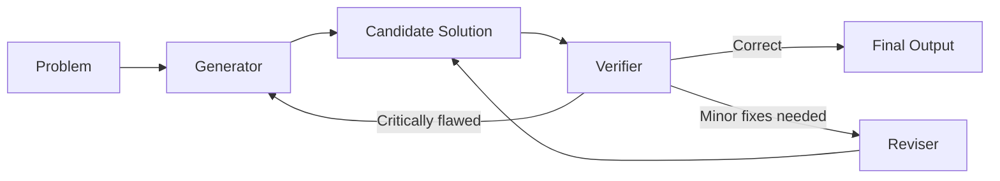

# 数学证明助手（Proof Assistant）

一个面向“证明思路整理 + 证明草稿生成”的 Web 项目。  
你输入**定理陈述**和**已知条件**，系统会先给你可行的证明路线，再生成可渲染（MathJax）的证明文本。

---

## 这个项目可以做什么？

### 1) 自动生成“可执行”的证明思路
- 根据你输入的问题，先返回：
  - `Possible Proof Ideas`（可能的证明路线）
  - `Candidate Theorems`（候选定理 + 为什么有用）
- 适合在正式写证明前，先做“路线筛选”。

### 2) 生成证明草稿（支持公式渲染）
- 支持把证明结果切换为：
  - **Compiled**（MathJax 渲染视图）
  - **Source**（原始文本）
- 方便你二次编辑并粘贴到论文、笔记或教学材料。

### 3) 多模型可切换
- `Gemini 2.5 Flash`
- `DeepSeek Chat`
- `DeepSeek Reasoner`

你可以在界面中切换模型，对比不同模型的证明风格与严谨度。

---

## AI 思路（工作流）

这个项目不是“直接一句话吐证明”，而是分阶段执行：



1. **Problem（问题输入）**：读取 Theorem + Assumptions，明确要证明什么、可用什么。  
2. **Literature Search（文献检索）**：按关键词、结构和领域术语检索可参考文献，做候选筛选与重排。  
3. **Generator（候选解生成）**：输出 `Possible Proof Ideas`（可行路线）和 `Candidate Solution`（候选证明草稿）。  
4. **Verifier（严格校验）**：判定 `PASS / MINOR_FIX / REGENERATE`。  
5. **Reviser（小修订）**：若是可局部修复，按 verifier 反馈最小改动，再回到校验。  
6. **Regenerate（重生成）**：若是关键逻辑断裂或方向错误，回到 generator 重走路线。  
7. **Final Output（终止与输出）**：通过校验后输出最终证明；若达到轮次上限则输出“最佳可用解 + 风险提示”。  
8. **Compiled 展示**：用 MathJax 渲染为可读的公式版证明，便于复核与编辑。

### 为什么要重点做 Literature Search？

- **降低“拍脑袋证明”的概率**：先找历史上常见的证明模板（反证法、构造法、归纳法、极值法、浓缩不等式技巧等），再生成 proof。  
- **提供可复用的中间引理**：很多证明失败不是目标错，而是缺关键引理。文献能补齐这一步。  
- **提前暴露边界条件与反例**：文献中的 counterexample、假设条件、tight bound 能阻止模型走错方向。  
- **帮助 verifier 制定“审稿标准”**：文献给出规范写法与常见漏洞点（量词、定义域、可测性、交换极限条件等）。

### Possible Proof 是什么？为什么重要？

- **Possible Proof** 不是“最终证明”，而是“可执行候选路线 + 关键跳板”。
- 它通常包含：
  - 目标分解（主命题拆成子命题）；
  - 计划使用的定理/引理及其适用条件；
  - 每一步是否可验证（是否能被 verifier 检查）；
  - 风险点（哪些步骤可能需要额外假设）。
- 价值在于：
  - 先判断“这条路值不值得走”；
  - 即使失败，也能把失败定位到某个子步骤，便于 reviser 精修或 regenerate 重来。

### Literature 如何帮助 AI 真正“做 proof”？

把 literature 当作“结构化先验知识库”，它对 AI 的帮助主要体现在：

1. **检索阶段**：给出与当前命题最接近的 theorem family、经典技巧和可复用定义。  
2. **生成阶段**：把“文献中的证明骨架”映射到当前问题，得到更稳健的 candidate proof。  
3. **校验阶段**：用文献中的已知必要条件检查当前证明是否越界（例如偷换条件、缺失约束）。  
4. **修订阶段**：当 verifier 指出漏洞时，优先回填文献已有 lemma 或替换为已知稳定手法。  

一句话：**literature 让 AI 从“语言生成”走向“基于证据的证明构造”**。

> 这样设计的好处：
> - 用户先看到“为什么这么证”，而不是只看到“结果”。
> - 更适合教学、讨论和多人协作审稿。

---

## Workspace Example: Theorem 1 (Threshold Selection and Error-Rate Control)

<small>This workspace example is adapted from your provided theorem image and is structured to demonstrate the workflow: literature search → candidate proof → verification → revision.</small>

### Known Assumptions

<small>
Let prior thresholds \(t_1,\dots,t_{i-1}\) be fixed. On the left-out class \(S_{i_t}\), define
\[
\overline{T}_i = \{T_i(X)\mid X\in S_{i_t}\},
\]
and the filtered subset (conditioned on previous thresholds)
\[
\overline{T}'_i=\{T_i(X)\mid X\in S_{i_t},\ T_1(X)<t_1,\dots,T_{i-1}(X)<t_{i-1}\}.
\]
Let \(t_{i(k)}\) and \(t'_{i(k)}\) denote the \(k\)-th order statistics of \(\overline{T}_i\) and \(\overline{T}'_i\), respectively. Let \(n_i\) and \(n'_i\) be their cardinalities. Let \(\alpha_i\) and \(\delta_i\) be the target control level and violation tolerance for the \(i\)-th under-classification error \(R_{i\star}(\cdot)\).

Define
\[
\hat p_i=\frac{n'_i}{n_i},\quad p_i=\hat p_i+c(n_i),\quad \alpha'_i=\frac{\alpha_i}{p_i},\quad
\delta'_i=\delta_i-\exp\{-2n_i c^2(n_i)\},
\]
where \(c(n)=O(1/\sqrt n)\). Also define
\[
\bar t_i=
\begin{cases}
t'_{i(k'_i)}, & \text{if } n'_i\ge \log\delta'_i/\log(1-\alpha'_i)\ \text{and}\ \alpha'_i<1,\\
t_{i(k_i)}, & \text{otherwise},
\end{cases}
\]
with
\[
k_i=\max\{k\in[n_i]\mid v(k,n_i,\alpha_i)\le\delta_i\},\quad
k'_i=\max\{k\in[n'_i]\mid v(k,n'_i,\alpha'_i)\le\delta'_i\}.
\]
</small>

### Theorem Statement

<small>
For all \(t_i\le \bar t_i\),
\[
\mathbb P\big(R_{i\star}(\hat\phi)>\alpha_i\big)
=
\mathbb P\Big(P_i\big[T_1(X)<t_1,\dots,T_i(X)<t_i\mid \bar t_i\big]>\alpha_i\Big)
\le\delta_i.
\]
</small>

In this workspace example, the system can automatically produce:

- `Possible Proof Ideas`: order-statistics argument + concentration bounds (e.g., Hoeffding-type control) + piecewise threshold construction.  
- `Candidate Theorems`: related results on quantile control, selection-bias correction, and conditional-probability upper bounds.  
- `Verifier Checklist`: completeness of assumptions, positivity of \(\delta'_i\), and whether piecewise conditions cover all cases.

---

## 项目架构

- **前端**：React + Vite
- **后端**：Vercel Serverless Functions
- **模型接入**：Gemini / DeepSeek
- **渲染**：MathJax

### API 路由
- `POST /api/generate-ideas`：Gemini 思路生成
- `POST /api/generate-ideas-deepseek`：DeepSeek 思路生成
- `POST /api/generate-proof`：Gemini 证明生成
- `POST /api/generate-proof-deepseek`：DeepSeek 证明生成
- `POST /api/verify-proof`：Gemini 证明校验
- `POST /api/verify-proof-deepseek`：DeepSeek 证明校验
- `POST /api/revise-proof`：Gemini 小修订
- `POST /api/revise-proof-deepseek`：DeepSeek 小修订

---

## 快速开始（本地）

### 1. 安装依赖

```bash
npm install
```

### 2. 配置环境变量

创建 `.env.local`（或在 Vercel 配环境变量）：

```env
GEMINI_API_KEY=your_gemini_key
DEEPSEEK_API_KEY=your_deepseek_key
```

> 只使用 Gemini 时，可只配置 `GEMINI_API_KEY`。  
> 若在 UI 选择 DeepSeek 模型，则必须配置 `DEEPSEEK_API_KEY`。

### 3. 启动开发环境

```bash
npm run dev
```

默认访问：`http://localhost:3000`

### 4. 质量检查

```bash
npm run lint
npm run build
```

---

## 部署（Vercel）

1. 将仓库推送到 GitHub。  
2. 在 Vercel 导入该仓库。  
3. 配置环境变量：
   - `GEMINI_API_KEY`
   - `DEEPSEEK_API_KEY`（如需 DeepSeek）
4. 点击 Deploy。

---

## 适用场景

- 数学课程作业中的证明草稿探索
- 论文写作前的证明路径头脑风暴
- 团队讨论时快速对比不同证明策略
- 教学中展示“从想法到证明”的完整链路

---

## 注意事项

- 本项目输出的是 **AI 生成证明草稿**，不保证 100% 正确。  
- 用于作业、论文或正式发表前，请务必人工校验关键步骤。  
- 对高难度命题，建议结合文献与人工推导共同验证。

---

## 项目结构

```text
.
├─ api/
│  ├─ generate-ideas.ts
│  ├─ generate-ideas-deepseek.ts
│  ├─ generate-proof.ts
│  ├─ generate-proof-deepseek.ts
│  ├─ verify-proof.ts
│  ├─ verify-proof-deepseek.ts
│  ├─ revise-proof.ts
│  └─ revise-proof-deepseek.ts
├─ src/
│  ├─ App.tsx
│  ├─ main.tsx
│  └─ index.css
├─ index.html
├─ package.json
├─ tsconfig.json
├─ vite.config.ts
└─ vercel.json
```
